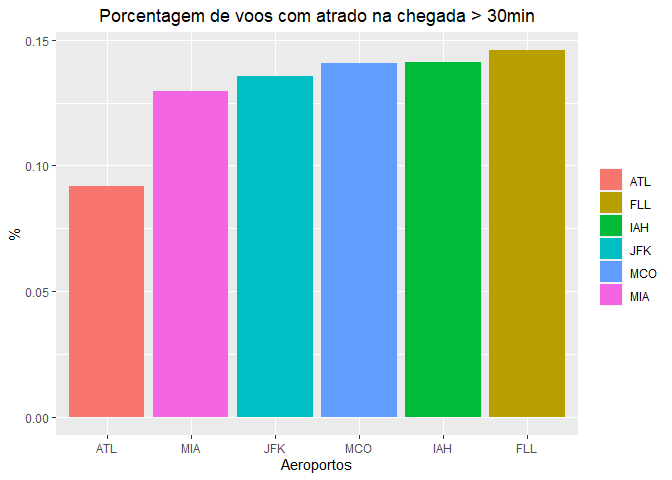
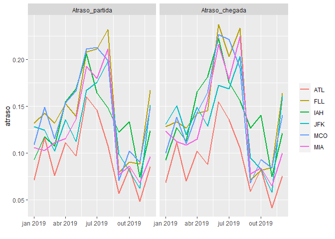
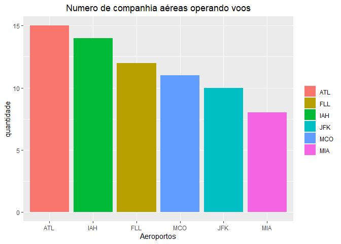
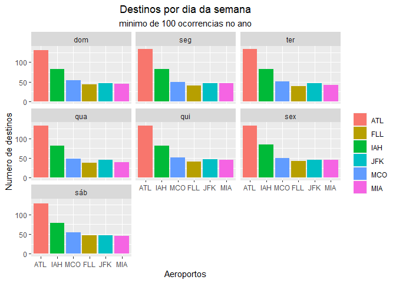

<!-- README.md is generated from README.Rmd. Please edit that file -->

# tccR4ds2

<!-- badges: start -->

[](https://github.com/mendoncalf/tccR4ds2/actions)
[](https://github.com/mendoncalf/tccR4ds2/actions/workflows/pkgdown.yaml)
[](https://github.com/mendoncalf/tccR4ds2/actions/workflows/test-coverage.yaml)
<!-- badges: end -->

O objetivo desse pacote é servir de repositório para as análises do TCC
do curso de R4DS2 da curso-R, turma de abril de 2021.

## Instalação

Esse pacote tem como subproduto de suas analises algumas funções. Para
saber mais sobre elas, instale o pacote e leia a documentação ou acesse
o [site do pacote](https://mendoncalf.github.io/tccR4ds2/) e veja os
[exemplos](https://mendoncalf.github.io/tccR4ds2/articles/funcoes.html).

``` r
# install.packages("devtools")
devtools::install_github("mendoncalf/tccR4ds2")
```

# Por qual aeroporto devo chegar aos EUA?

Segundo a postagem do site [passageiro de
primeira](https://passageirodeprimeira.com/lista-das-companhias-aereas-que-ainda-estao-voan%20o-entre-os-eua-e-o-brasil/)
os aeroportos nos EUA que mais recebem voos do Brasil são: **Miami
(MIA)**, **Orlando (MCO)**, **Nova York (JFK)**, **Atlanta (ATL)**,
**Houston (IAH)** e **Fort Lauderdale (FLL)**.

Nesse contexto, nos propomos a analisar quais desses aeroportos seria a
melhor opção para um Brasileiro chegar aos EUA. Ignorando parâmetros de
preço de passagem aérea, e usando as bases de dados do pacote
[`anyflights`](https://github.com/simonpcouch/anyflights), vamos avaliar
a performance desses 6 aeroportos com base em **atrasos**, **número de
companhias aéreas**, **oferta de destinos**, e **conexões com destinos
chave**. Foram considerados apenas os voos do ano de 2019 para a
análise, por serem os dados mais recentes sem impacto da pandemia de
COVID-19.

## 1 - Atrasos

Considerando os atrasos de partida, ou seja, a diferença entre o horário
programado para a saída do aeroporto de interesse e a real saída, vemos
que **Atlanta (ATL)** se destaca, sendo o aeroporto com menor percentual
de decolagens atrasadas, seguido por **Miami (MIA)** e **Nova York
(JFK)**


<br>

Esses mesmos voos podem ser olhados sob a perspectiva do atraso em seus
destinos, que de fato é o que importa ao passageiro. A correlação é
alta, claro, uma vez que se um voo decolou com atraso, possivelmente
chegará ao seu destino com atraso. Sendo assim, novamente **Atlanta
(ATL)** leva a melhor, ainda seguido por **Miami (MIA)** e **Nova York
(JFK)**



<br>

Vendo o atraso sobre a ótica de um serie temporal, pouco muda em relação
a posição relativa dos aeroportos. No entanto, é interessante notar que
a maior quantidade de atrasos ocorre entre **Maio a Agosto** (Verão
americano), possivelmente um período de intensificação das viagens
aéreas. Por outro lado, menos atraso ocorre nos meses de **Setembro a
Novembro**. É sempre bom lembrar que esses dados são apenas de 2019,
assim particularidades desse ano podem viesar esse comportamento em
relação aos dados históricos.



<br>

### Placar 1

**Atlanta (ATL)** - 3 pontos <br> **Miami (MIA)** - 2 pontos <br> **Nova
York (JFK)** - 1 ponto <br>

<br>

## 2 - Número de companhas aéreas

Novamente **Atlanta (ATL)** se sai melhor, com sedo o aeroporto com mais
empresas aéreas operando voos, sendo 15 no total seguido por **Houston
(IAH)** e **Fort Lauderdale (FLL)**



<br>

### Placar 2

**Atlanta (ATL)** - 3 pontos <br> **Houston (IAH)** - 2 pontos <br>
**Fort Lauderdale (FLL)** - 1 ponto<br>

<br>

## 3 - Oferta de destinos

**Atlanta (ATL)** segue superando os adversários e leva mais uma, agora
ele também é o aeroporto com maior quantidade de destinos domestico
regulares, em todos os dias da semana. São mais de 100 destinos dentro
dos EUA! Em segundo lugar temos **Houston (IAH)** e em terceiro vem
**Orlando (MCO)**.



<br>

### Placar 3

**Atlanta (ATL)** - 3 pontos <br> **Houston (IAH)** - 2 pontos<br>
**Orlando (MCO)** - 1 ponto<br>

## 4 - Oferta de destinos chave

<br>

Destinos ao montes são otimos, no entanto, os Brasileiros procuram
cidades muito especificas nos EUA. Parte dessas cidades claro são as
mesmas cidades dessa análise, mas existem outras tão procuradas quanto,
mas que a frequencia de voos diretos do Brasil é baixa. Novamente fomos
a *internet* e após algumas pesquisas selecionamos outras 6 cidades não
contempladas na lista de cidades com mais voos diretos do Brasil. E
agora queremos saber se nossos 6 aeroportos favoritos possuem voos de
conexão para essas cidades.

Os destinos chave são: **Los Angeles**, **Las Vegas**, **São
Francisco**, **Boston**, **Chicago** e por fim a capital **Washington
D.C.**

Nesse quesito quase todos os aeroportos empatam, apenas **Miami (MIA)**
falha em um dos destinos. Normal, afinal todas essas são grandes cidades
e é esperado que os principais aeroportos se conectem a elas.


<br>

### Placar 4

**Orlando (MCO)**, **Nova York (JFK)**, **Atlanta (ATL)**, **Houston
(IAH)** e **Fort Lauderdale (FLL)** - 3 pontos <br> **Miami (MIA)** - 2
pontos <br>

<br>

## Placar Final

**1° Lugar: Atlanta (ATL) - 12 pontos** <br> **2° Lugar: Houston (IAH) -
7 pontos** <br> **3° Lugar: Todos os demais empatam - 4 pontos** <br>

Interessante notar que por si só Atlanta e Houston não estão entre as
cidades preferidas dos Brasileiros, mesmo assim, possuem excelente
aeroportos. Não obstante, o aeroporto de Atlanta é considerado o maior
do mundo em numero de passageiros, e um dos mais eficientes também, como
nós mesmos pudemos comprovar. Assim, mesmo que não seja seu destino
final, pode ser que você passe por eles.

<br>

## Extra - Curiosidade: maiores atrasos e antecipações de cada aeroporto

Já pensou esperar um voo por mais de um dia? Pois é, isso acontece!
Investigando os maiores atrasos de cada aeroporto, em 4 dos 6 existiram
situações de atrasos maiores que 24h, sendo a maior ocorrido no
aeroporto de **Orlando** num voo com destino a **Dallas** no Texas, com
1 dia e 5 horas de atraso.

| origem | destino | data       | atraso\_partida |
|:-------|:--------|:-----------|----------------:|
| MCO    | DFW     | 2019-03-30 |     1d 5H 2M 0S |
| IAH    | BOS     | 2019-12-02 |    1d 2H 40M 0S |
| JFK    | HNL     | 2019-02-19 |    1d 1H 36M 0S |
| ATL    | IAH     | 2019-02-03 |    1d 0H 20M 0S |
| FLL    | CLT     | 2019-04-14 |      23H 46M 0S |
| MIA    | EWR     | 2019-08-07 |      22H 41M 0S |

<br>

Já o contrario, ou seja, ter tudo pronto para a partida antes do
horário, também acontece. O nosso campeão novamente não nos decepciona e
crava mais uma, tendo para si o voo de maior antecipação. Um voo de
**Atlanta** com destino a **Mobile** no Alabama saiu quase 1 hora antes
do horário previsto. É quase o mesmo tempo de voo entre as duas cidades!

| origem | destino | data       | antecipacao\_partida |
|:-------|:--------|:-----------|---------------------:|
| ATL    | MOB     | 2019-04-11 |              -52M 0S |
| FLL    | DTW     | 2019-09-02 |              -43M 0S |
| MCO    | ATL     | 2019-04-08 |              -30M 0S |
| MIA    | RDU     | 2019-10-10 |              -26M 0S |
| JFK    | BUF     | 2019-01-29 |              -24M 0S |
| JFK    | RIC     | 2019-05-21 |              -24M 0S |
| IAH    | PHL     | 2019-07-20 |              -24M 0S |
